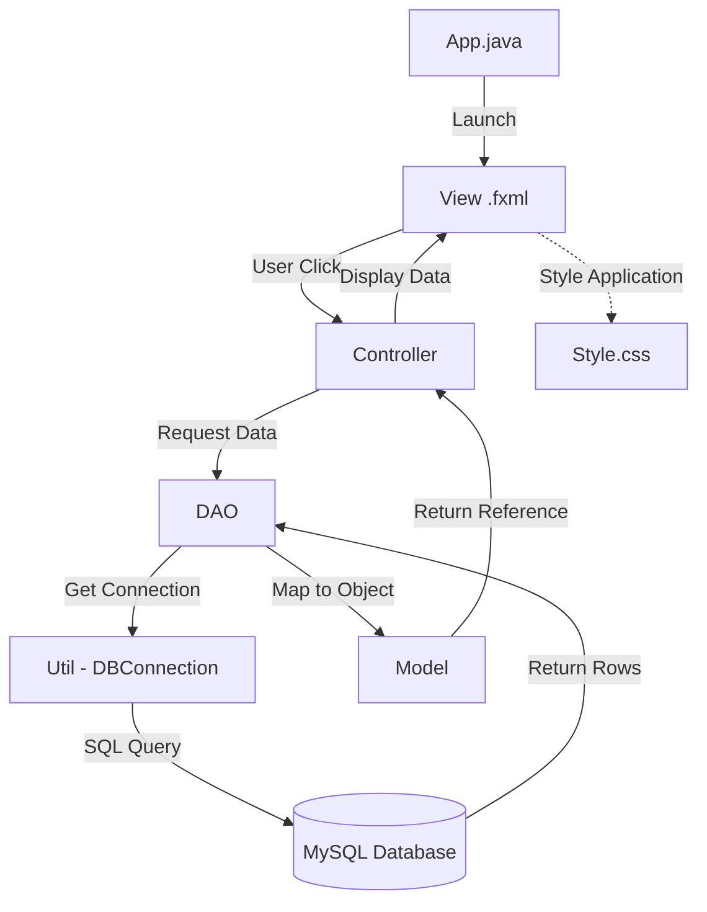
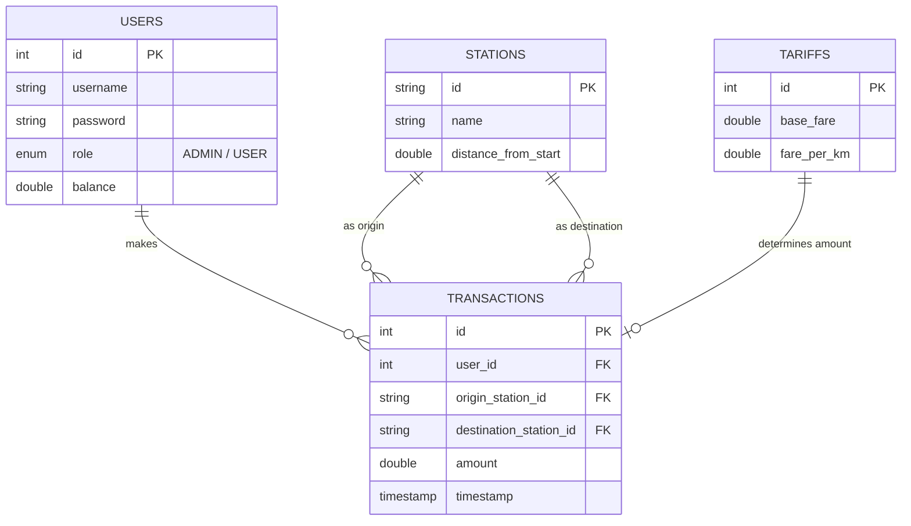

# LAPORAN PROYEK MATA KULIAH PBO
## Judul: Sistem Tiket KRL Terpadu (JavaFX & MySQL)

---

### 1. Daftar Isi
1. [Latar Belakang](#2-latar-belakang)
2. [Tujuan Sistem](#3-tujuan-sistem)
3. [Teknologi & Lingkungan Pengembangan](#4-teknologi--lingkungan-pengembangan)
4. [Penjelasan Komponen Sistem](#5-penjelasan-komponen-sistem)
5. [Hubungan Antar Komponen (Workflow)](#6-hubungan-antar-komponen-workflow)
6. [Skema Database](#7-skema-database)
7. [Implementasi Detail Konsep PBO](#8-implementasi-detail-konsep-pbo)
8. [Kesimpulan](#9-kesimpulan)

---

### 2. Latar Belakang
Transportasi kereta komuter (KRL) memerlukan sistem manajemen tiket yang efisien untuk menangani volume penumpang yang besar, perhitungan tarif yang akurat berdasarkan jarak yang ditempuh, serta pengelolaan data pengguna yang aman. Proyek ini mensimulasikan sistem ticketing tersebut dengan menerapkan prinsip-prinsip Pemrograman Berorientasi Objek (PBO) yang profesional.

### 3. Tujuan Sistem
- Mengelola data user (Admin & Passenger).
- Mengelola data stasiun dan tarif perjalanan secara dinamis.
- Menerapkan logika tarif asli (KRL Jabodetabek) dalam pembelian tiket.
- Memberikan transparansi riwayat transaksi bagi penumpang.

### 4. Teknologi & Lingkungan Pengembangan
- **Bahasa**: Java 21
- **UI Framework**: JavaFX (FXML)
- **Database**: MySQL 8.0
- **Build Tool**: Maven

---

### 5. Penjelasan Komponen Sistem

| Komponen | Fungsi Utama | Perumpamaan |
| :--- | :--- | :--- |
| **Model** | Representasi data (objek). Contoh: `User`, `Station`, `Transaction`. Hanya berisi atribut dan getter/setter. | **Barang**: Apa yang diproses. |
| **View (`.fxml`)** | Desain tata letak UI. Berisi elemen visual seperti tombol, tabel, dan input. | **Panggung**: Apa yang dilihat penonton. |
| **Controller** | Otak aplikasi. Pengatur logika saat tombol diklik, mengisi data ke tabel, dan validasi input. | **Sutradara**: Pengatur jalannya aksi. |
| **DAO** | Jembatan ke Database. Berisi query SQL (`SELECT`, `INSERT`, `UPDATE`, `DELETE`). | **Kurir**: Yang mengambil/menyimpan barang ke gudang. |
| **Util** | Alat bantu teknis. Contoh: `DBConnection` untuk membuka koneksi ke MySQL. | **Kunci Gudang**: Alat untuk akses ke database. |
| **App.java** | Main class yang mengatur perpindahan antar halaman (scene swapping). | **Pintu Utama**: Tempat masuk pertama kali. |
| **Style.css** | Mengatur estetika (warna, font, radius tombol) agar UI selaras. | **Dekorasi**: Cat dan riasan panggung. |

---

### 6. Hubungan Antar Komponen (Workflow)
Bagaimana komponen-komponen di atas saling terhubung:

1.  **User Interaction**: Pengguna klik tombol "Bayar" di **View** (`passenger_booking.fxml`).
2.  **Controller Action**: View memicu method `handlePay()` di **Controller** (`PassengerBookingController`).
3.  **Logic & DAO**: Controller meminta **DAO** (`UserDAO` & `TransactionDAO`) untuk memproses transaksi.
4.  **Database Connection**: DAO menggunakan **Util** (`DBConnection`) untuk mengeksekusi perintah SQL.
5.  **Data Mapping**: Hasil database dibungkus menjadi objek **Model** (`Transaction`) oleh DAO.
6.  **UI Update**: Controller menerima objek Model dan memperbarui tampilan **View** (Struk Tiket muncul).

#### Visualisasi Flow (Mermaid):

---

---

### 7. Perancangan Database (Detailed Schema)

Sistem menggunakan database relasional (MySQL) dengan struktur yang dioptimalkan untuk performa dan integritas data.

#### A. Entity Relationship Diagram (ERD)
Hubungan antar tabel digambarkan sebagai berikut:

#### B. Kamus Data (Data Dictionary)

**1. Tabel: `users`**
Menyimpan data kredensial dan saldo pengguna.
| field | Type | Key | Description |
| :--- | :--- | :--- | :--- |
| `id` | INT | PK | ID unik pengguna (Auto Increment). |
| `username` | VARCHAR(50)| UNIQUE | Nama pengguna untuk login. |
| `password` | VARCHAR(255)| - | Kata sandi pengguna. |
| `role` | ENUM | - | Peran pengguna ('ADMIN' atau 'USER'). |
| `balance` | DOUBLE | - | Saldo yang dimiliki (khusus role USER). |

**2. Tabel: `stations`**
Menyimpan daftar stasiun dan titik koordinat jaraknya.
| field | Type | Key | Description |
| :--- | :--- | :--- | :--- |
| `id` | VARCHAR(10)| PK | Kode unik stasiun (Contoh: 'JKT', 'BOO'). |
| `name` | VARCHAR(100)| - | Nama lengkap stasiun. |
| `distance_from_start`| DOUBLE | - | Jarak stasiun dari titik 0 KM. |

**3. Tabel: `transactions`**
Mencatat setiap pembelian tiket yang dilakukan penumpang.
| field | Type | Key | Description |
| :--- | :--- | :--- | :--- |
| `id` | INT | PK | ID unik transaksi. |
| `user_id` | INT | FK | ID pengguna yang melakukan transaksi. |
| `origin_station_id` | VARCHAR(10)| FK | ID stasiun asal. |
| `destination_station_id`| VARCHAR(10)| FK | ID stasiun tujuan. |
| `amount` | DOUBLE | - | Total biaya tiket yang dibayar. |
| `timestamp` | TIMESTAMP | - | Waktu terjadinya transaksi (Default: Current). |

**4. Tabel: `tariffs`**
Konfigurasi biaya perjalanan.
| field | Type | Key | Description |
| :--- | :--- | :--- | :--- |
| `id` | INT | PK | ID tarif (biasanya hanya 1 record). |
| `base_fare` | DOUBLE | - | Tarif dasar (25 km pertama). |
| `fare_per_km` | DOUBLE | - | Penambahan tarif per km berikutnya. |

---

### 8. Implementasi Detail Konsep PBO

#### A. Abstraction (Abstraksi)
- **File**: `User.java` (Abstract Class)
- **Penjelasan**: Class ini dideklarasikan dengan `abstract` karena secara logika tidak ada objek yang murni hanya "User". User harus memiliki peran spesifik.
- **Detail**: Mendefinisikan kerangka umum (`id`, `username`, `role`) yang wajib dimiliki oleh semua jenis user.

#### B. Inheritance (Pewarisan)
- **File**: `Admin.java` & `Passenger.java`
- **Detail**: `Admin extends User` dan `Passenger extends User`.
- **Manfaat**: Menghindari duplikasi kode. `Passenger` mewarisi atribut `username` dari `User` tapi menambahkan atribut spesifik seperti `balance`.

#### C. Encapsulation (Enkapsulasi)
- **File**: `User.java`, `Station.java`, `Transaction.java`, `Tariff.java`
- **Detail**: Semua variabel atribut menggunakan modifier **`private`**. Akses diberikan melalui **`public getter & setter`**.
- **Efek**: Melindungi data sensitif agar tidak bisa diubah secara ilegal oleh class lain tanpa melalui validasi.

#### D. Polymorphism (Polimorfisme)
- **File**: `UserDAO.java` (Method `login`)
- **Detail**: Method `login` mengembalikan tipe data `User`, namun secara dinamis bisa berisi instance `Admin` atau `Passenger`.
- **File**: `App.java`
- **Detail**: Variabel `currentUser` tipe `User` bisa menyimpan objek `Admin` atau `Passenger` secara bergantian, dan aplikasi akan menyesuaikan tampilan secara otomatis.

---

### 9. Kesimpulan
Proyek ini berhasil mengimplementasikan arsitektur **MVC + DAO** yang rapi dengan penerapan konsep PBO yang mendalam. Pemisahan tanggung jawab antar file memastikan kode mudah untuk diuji, dirawat, dan dikembangkan lebih lanjut (misalnya integrasi pembayaran online di masa depan).
